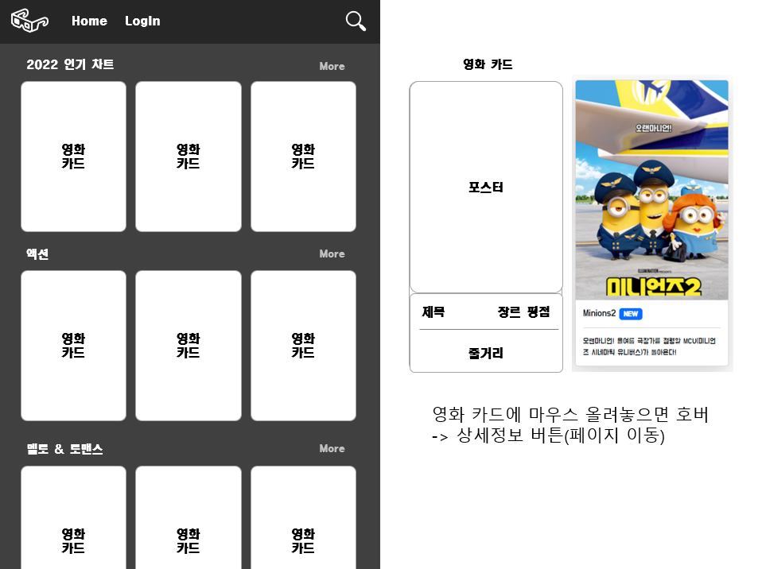
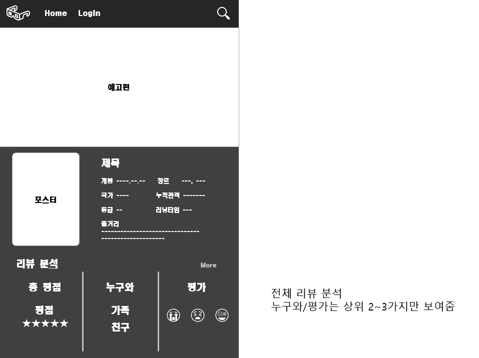
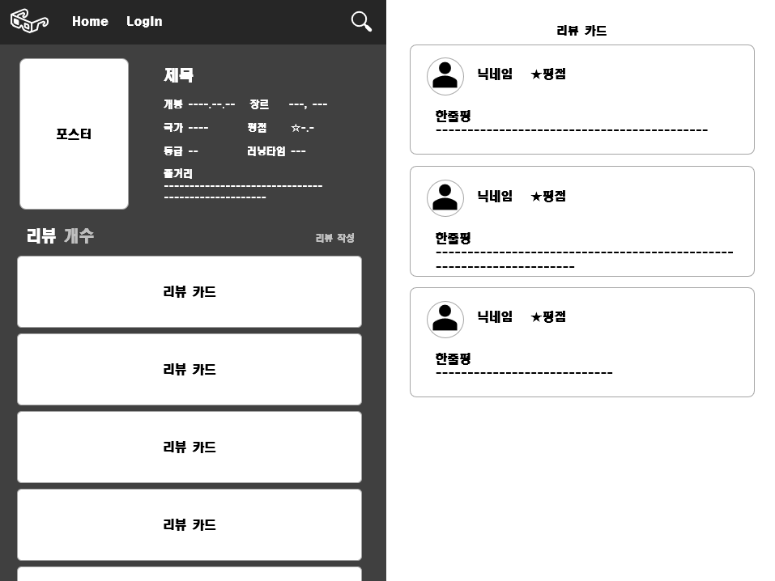
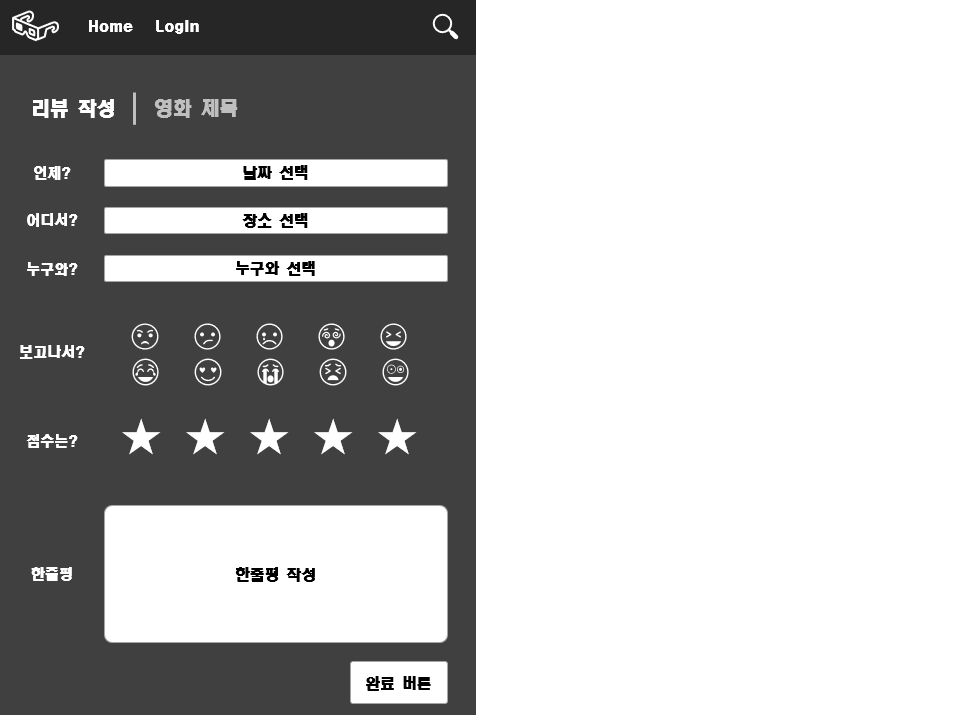

# 영화 리뷰 커뮤니티 개발 프로젝트

## 기능 조사 및 설계

### 0. 로그인/회원가입 페이지

### 1. 영화 목록 페이지

- 영화 카드

  - 포스터

  - 제목

  - 장르

  - 평점

  - 더보기 버튼(영화 상세 페이지)

- 더보기 버튼

### 2. 영화 상세 페이지

- 영화 상세정보

  - 영화 예고편
  - 포스터

  - 제목
  - 장르
  - 평점

  - 개봉일

  - 줄거리

- 리뷰 분석

  - 총 평점
  - 누구와
  - 평가
  - 더보기 버튼(리뷰 목록 페이지)

### 2. 리뷰 목록 페이지

- 영화 요약정보
  - 포스터
  - 제목
  - 장르
  - 평점
- 리뷰 카드
  - 프로필
  - 닉네임
  - 평점
  - 한줄평
- 리뷰 작성 버튼(리뷰 작성 페이지)

### 3. 리뷰 작성 페이지

- 리뷰 작성 폼

  - 영화 제목
  - 관람일

  - 장소(집, 영화관, 기타... )

  - 누구와 함께(혼자, 애인, 가족, 친구... )

  - 평가(😂웃김, 😭슬픔, 🤔흥미진진, 😱무서움... )

  - 평점

  - 한줄평

- 리뷰 작성 완료 버튼

## 화면 조사 및 설계

- 영화 목록 페이지 설계

- 영화 상세 페이지 설계

- 리뷰 목록 페이지 설계

- 리뷰 작성 페이지 설계

